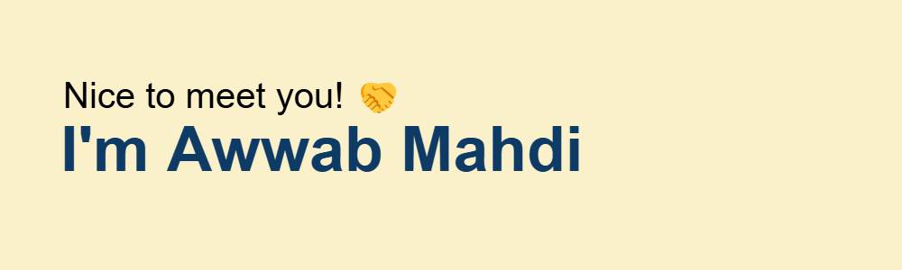

### Languages

### Technologies

  <!-- Monospace Font -->
  <samp>
    <a href="https://a--ab.com/">website</a> .
    <a href="https://www.linkedin.com/in/awwabm/">linkedin</a> .
    <a href="https://rxresu.me/obliviance/awwab-mahdi-resume-main">resume</a>
  </samp>

